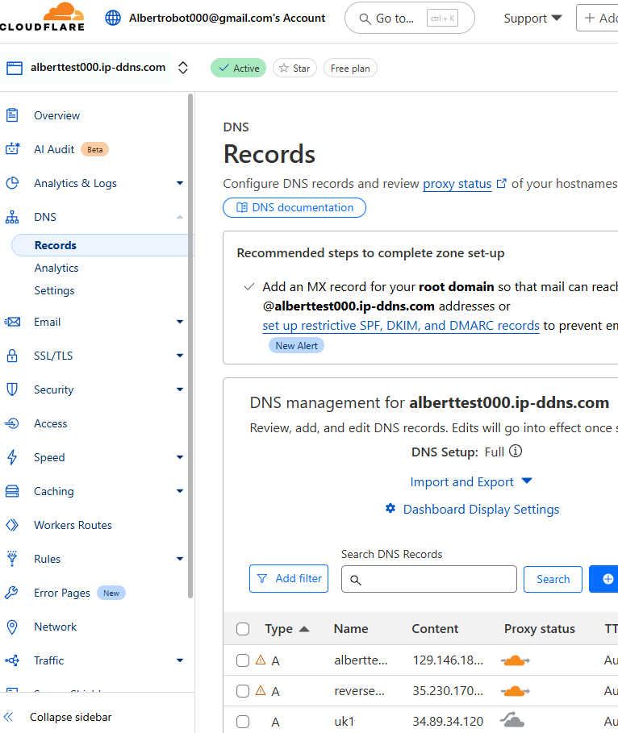
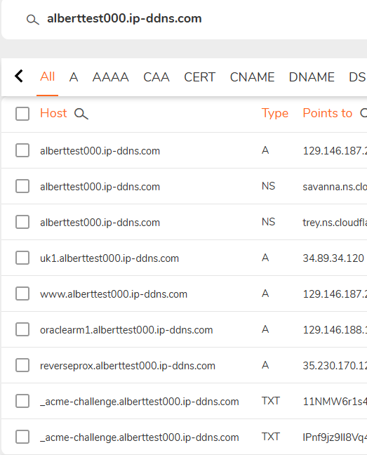

# 🧾 Query: domain name

## 📌 Description

## Update both record for both sites

## cloudflare

- DNS record



## CloudDNS



```bash
C:\Users\Burto He>nslookup alberttest000.ip-ddns.com
Server:  dns.cp.net.rogers.com
Address:  2607:f788:28:10:0:640:7125:5204

Non-authoritative answer:
Name:    alberttest000.ip-ddns.com
Address:  129.146.187.24


C:\Users\Burto He>
```
