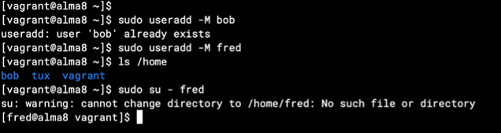

# 🧾 Query: openssh hardening

## 📌 Description

Create a new user and give that user sudo privilage

```bash
hostnamectl
```

```console
Static hostname: debian
       Icon name: computer-vm
         Chassis: vm 🖴
      Machine ID: 90895d78116b4c0db94fec5dee86e700
         Boot ID: 931a2304bb1948348ecc36ba7309d60d
  Virtualization: kvm
Operating System: Debian GNU/Linux 12 (bookworm)
          Kernel: Linux 6.1.0-34-amd64
    Architecture: x86-64
 Hardware Vendor: QEMU
  Hardware Model: Standard PC _i440FX + PIIX, 1996_
Firmware Version: 1.16.0-4.module+el8.8.0+21164+ed375313
```

- <span style="color:yellow">_asterisk_</span> (\*) to retrieve all columns

## 💻 Add user and give sudo privilage

- change root password

```bash
sudo passwd root
```

```bash
sudo su

adduser albert

usermod -aG sudo albert

su - albert

sudo ls /
```

```console
cloudsigma@Debian-12-10:~$ sudo su
sudo: unable to resolve host Debian-12-10: Name or service not known
[sudo] password for cloudsigma:
root@Debian-12-10:/home/cloudsigma# adduser albert
Adding user `albert' ...
Adding new group `albert' (1001) ...
Adding new user `albert' (1001) with group `albert (1001)' ...
Creating home directory `/home/albert' ...
Copying files from `/etc/skel' ...
New password:
Retype new password:
passwd: password updated successfully
Changing the user information for albert
Enter the new value, or press ENTER for the default
Full Name []: albert
Room Number []:
Work Phone []:
Home Phone []:
Other []:
Is the information correct? [Y/n] y
Adding new user `albert' to supplemental / extra groups `users' ...
Adding user `albert' to group `users' ...
root@Debian-12-10:/home/cloudsigma# usermod -aG sudo albert
root@Debian-12-10:/home/cloudsigma#
root@Debian-12-10:/home/cloudsigma# su - albert
albert@Debian-12-10:~$
albert@Debian-12-10:~$ sudo ls /
sudo: unable to resolve host Debian-12-10: Name or service not known
[sudo] password for albert:
bin home lib64 opt sbin usr
boot initrd.img lost+found proc srv var
dev initrd.img.old media root sys vmlinuz
etc lib mnt run tmp vmlinuz.old
albert@Debian-12-10:~$
```

```
albert@Debian-12-10:~$ sudo apt install tmux
```

## SSH key login (still need passwordAuthentication to allow ssh-copy-id)

### Windows:

- PowerShell:

```bash
ssh-keygen -t rsa -b 4096

type $env:USERPROFILE\.ssh\id_rsa.pub | ssh albert@129.153.208.7 "mkdir -p ~/.ssh && cat >> ~/.ssh/authorized_keys && chmod 600 ~/.ssh/authorized_keys && chmod 700 ~/.ssh"

```

- Install Git for Windows:
  Download from https://git-scm.com, Open Git Bash and run:

  ```bash
  ssh-copy-id albert@185.12.4.145
  ```

  - it will ask for user password once to copy the ssh key to remote/server

### Linux:

```bash
 ssh-copy-id albert@185.12.4.145
```

- To find SSH information

### Windows:

```
C:\Users\Botao He\.ssh\
```

### Linux:

```
ls -ld ~/.ssh
ls -l ~/.ssh/authorized_keys

chmod 700 ~/.ssh
chmod 600 ~/.ssh/authorized_keys

```

## Configure sshd

```bash
sudo nano /etc/ssh/sshd_config
```

- /etc/ssh/sshd_config:

  ```
  PubkeyAuthentication yes
  PasswordAuthentication yes   # (or no, if you're ready to disable passwords)
  AuthorizedKeysFile .ssh/authorized_keys

  PasswordAuthentication no
  PermitRootLogin no
  UsePAM no
  ```

```bash
sudo systemctl restart ssh
```

## After ssh restart login with rsa or no specify

```bash
ssh -i ~/.ssh/id_rsa albert@185.12.4.145

ssh albert@185.12.4.145
```

## SSH port change e.g. 2222

- here use iptasbles to open 2222 port for ssh connection

```bash
sudo nano /etc/ssh/sshd_config

PORT 2222
sudo iptables -A INPUT -p tcp --dport 2222 -j ACCEPT

sudo iptables -L INPUT -n --line-numbers | grep 2222

sudo systemctl restart ssh
```

- drop port 22, optional

```bash
sudo iptables -A INPUT -p tcp --dport 22 -j DROP
```

- sudo iptables -L INPUT -n --line-numbers | grep 2222

```console
albert@debian:~$ sudo iptables -L INPUT -n --line-numbers | grep 2222
9    ACCEPT     6    --  0.0.0.0/0            0.0.0.0/0            tcp dpt:2222
albert@debian:~$
```

## 🚦 Optional !!

## UsePAM

- <span style="color:yellow">UsePAM:</span> a directive in the SSH server configuration file (/etc/ssh/sshd_config) that controls whether the <span style="color:yellow">Pluggable Authentication Modules (PAM) system</span> is used for authentication.

  - PAM is a Linux framework that allows you to plug in different authentication methods—like passwords, biometric systems, or 2FA—into services such as SSH, sudo, su, etc.

```bash
ls /etc/pam.d
```

```console
albert@debian:~$ ls /etc/pam.d
atd       common-account   common-session-noninteractive  other      sshd  sudo-i
chfn      common-auth      cron                           passwd     su
chpasswd  common-password  login                          runuser    su-l
chsh      common-session   newusers                       runuser-l  sudo
albert@debian:~$
```

- Either of this will works

```bash
ls /usr/lib64/security/

ls /usr/lib/security/

ls /lib/x86_64-linux-gnu/security/
```

```console
albert@debian:~$ ls /lib/x86_64-linux-gnu/security/
pam_access.so     pam_keyinit.so    pam_pwhistory.so   pam_timestamp.so
pam_debug.so      pam_lastlog.so    pam_rhosts.so      pam_tty_audit.so
pam_deny.so       pam_limits.so     pam_rootok.so      pam_umask.so
pam_echo.so       pam_listfile.so   pam_securetty.so   pam_unix.so
pam_env.so        pam_localuser.so  pam_selinux.so     pam_userdb.so
pam_exec.so       pam_loginuid.so   pam_sepermit.so    pam_usertype.so
pam_faildelay.so  pam_mail.so       pam_setquota.so    pam_warn.so
pam_faillock.so   pam_mkhomedir.so  pam_shells.so      pam_wheel.so
pam_filter.so     pam_motd.so       pam_stress.so      pam_xauth.so
pam_ftp.so        pam_namespace.so  pam_succeed_if.so
pam_group.so      pam_nologin.so    pam_systemd.so
pam_issue.so      pam_permit.so     pam_time.so
albert@debian:~$
```

### sudo useradd -M bob: (not to creat the home directory)

```bash
sudo useradd -M fred

sudo su - fred
```



- To create a home directory

```bash
sudo nano /etc/pam.d/su-l
```

```
#%PAM-1.0
auth            include         su
account         include         su
password        include         su
session         optional        pam_keyinit.so force revoke
session         include         su
session optional pam_mkhomedir.so umask=077
```

<span style="color:yellow">session optional pam_mkhomedir.so umask=077</span>

    - umask=077: Sets default permissions for the new home directory. 077 means:

    User: full permissions (read/write/execute)

    Group/Other: no permissions


## find all user of linux

```bash
cut -d: -f1 /etc/passwd
```

```bash
awk -F: '$3 >= 1000 && $1 != "nobody" { print $1 }' /etc/passwd
```

- remove user

```bash
sudo userdel -r fred
```

```bash
sudo userdel username
sudo userdel -r username
who
sudo pkill -u username
sudo userdel -r username
```

- sudo userdel -r username

  - The -r flag removes the user’s:

    - Home directory (e.g., /home/username)

    - Mail spool (/var/mail/username)
